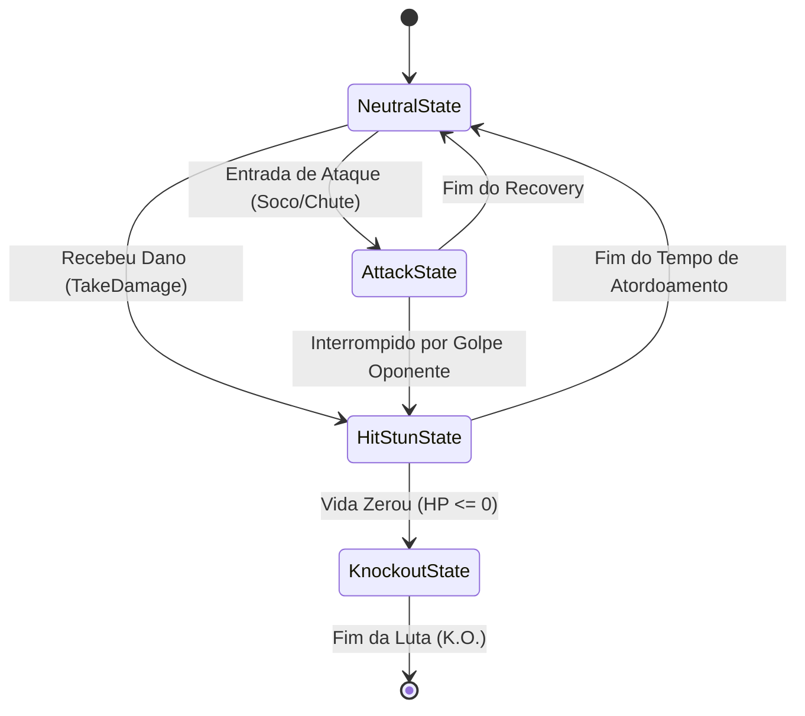
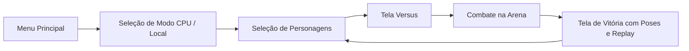

# 🥊 Guia Técnico e Arquitetura do Projeto (UnDFight)

Este documento descreve as **partes fundamentais**, **funções principais**, **fluxo de execução** e a **arquitetura de combate** do jogo de luta desenvolvido em Unity.

---

## 📑 Sumário
1. [Visão Geral da Arquitetura](#-visão-geral-da-arquitetura)
2. [Máquina de Estados dos Lutadores (FSM)](#-máquina-de-estados-dos-lutadores-fsm)
3. [Controlador do Lutador (`FighterController.cs`)](#-controlador-do-lutador-fightercontrollercs)
4. [Física e Movimentação 2.5D (`FighterMovement.cs`)](#-física-e-movimentação-25d-fightermovementcs)
5. [Sistema de Dano, Hitbox e Hurtbox](#-sistema-de-dano-hitbox-e-hurtbox)
6. [Sistema de Saúde e Integridade (`HealthSystem.cs`)](#-sistema-de-saúde-e-integridade-healthsystemcs)
7. [Inteligência Artificial de Sparring (`FighterSparringAI.cs`)](#-inteligência-artificial-de-sparring-fightersparringaics)
8. [Câmera Dinâmica de Luta (`TekkenCamera.cs`)](#-câmera-dinâmica-de-luta-tekkencameracs)
9. [Fluxo Geral do Jogo (`GameFlowController.cs`)](#-fluxo-geral-do-jogo-gameflowcontrollercs)
10. [Pipeline de Configuração e Editor (`FightingPrototypeSetup.cs`)](#-pipeline-de-configuração-e-editor-fightingprototypesetupcs)

---

## 🏛 Visão Geral da Arquitetura

O projeto adota uma arquitetura modular inspirada nos clássicos de luta (como *Tekken* e *Street Fighter*):
* **Movimento 2.5D:** O combate ocorre no eixo horizontal X, travado em uma faixa de profundidade no eixo Z.
* **Máquina de Estados Finitos (FSM):** Estados desacoplados (`Neutral`, `Attack`, `HitStun`, `Knockout`) implementando a interface `IFighterState`.
* **Detecção de Ataques com Janelas:** Separação estrita de frames ativos (*Startup*, *Active* e *Recovery*).
* **Hitstop / Freeze Frames:** Pausa momentânea na animação ao conectar o golpe para impacto visceral.

---

## 🔄 Máquina de Estados dos Lutadores (FSM)

A transição entre os estados do personagem é controlada por `FighterController` através da interface `IFighterState`:



### Estados:
1. **`NeutralState`**:
   * Permite movimentação, agachamento e salto.
   * Alimenta o parâmetro float `Speed` no Animator conforme o deslocamento horizontal.
   * Monitora inputs de ataque do jogador ou IA.
2. **`AttackState`**:
   * Trava a movimentação do personagem.
   * Aplica Root Motion horizontal se configurado.
   * Ativa a Hitbox do membro correspondente exclusivamente na janela útil (`activeStartNormalized` até `activeEndNormalized`).
   * Retorna ao neutro ao atingir `recoveryEndNormalized`.
3. **`HitStunState`**:
   * Estado de atordoamento temporário após ser atingido por um golpe.
   * Bloqueia novas ações enquanto o lutador se recupera.
4. **`KnockoutState`**:
   * Disparado quando o HP atinge zero.
   * Desativa CharacterController, hitboxes e aciona a animação de queda/derrota (`Dying`).

---

## 🥋 Controlador do Lutador (`FighterController.cs`)

É o componente central anexado a cada personagem. Faz a ponte entre inputs, animações, estados e colisões.

### Funções e Propriedades Chave:

| Função / Membro | Descrição |
| :--- | :--- |
| `ChangeState(IFighterState newState)` | Altera o estado atual da FSM, chamando `Exit()` no anterior e `Enter()` no novo. |
| `TriggerAttack(FighterAttackType attackType)` | Inicia o golpe primário ou secundário se o lutador estiver apto. |
| `ApplyDamage(DamageData data)` | Chamado pela Hurtbox quando o lutador é atingido; aciona Hitstop, knockback e muda para `HitStunState`. |
| `TriggerHitstop(float duration)` | Executa a corrotina de congelamento momentâneo da velocidade do Animator (`animator.speed = 0f`). |
| `SetAnimatorSpeed(float speed)` | Modifica com segurança a velocidade de reprodução do Animator. |
| `EnableCurrentAttackHitboxes()` | Ativa apenas o colisor do membro que está desferindo o ataque atual (`RightHand`, `RightFoot`, etc.). |
| `DisableAllHitboxes()` | Desativa imediatamente todos os colisores de ataque. |
| `TriggerKnockout()` | Chamado pelo `HealthSystem` ao zerar o HP; direciona o lutador para `KnockoutState`. |

---

## 🏃 Física e Movimentação 2.5D (`FighterMovement.cs`)

Gerencia o deslocamento e a física customizada sobre um `CharacterController`.

### Funções e Propriedades Chave:

| Função / Membro | Descrição |
| :--- | :--- |
| `CurrentInput` / `ExternalInput` | Vetor de entrada lido via novo *Input System* (Player) ou injetado via script (IA). |
| `UpdateLocomotion()` | Calcula a velocidade de avanço (`forwardSpeed`) ou recuo (`backwardSpeed`) em relação ao oponente. |
| `UpdateGravityAndJump()` | Aplica gravidade vertical contínua e processa o impulso de salto (`jumpHeight`). |
| `UpdateFacingDirection()` | Gira o lutador suavemente para mantê-lo sempre voltado de frente para o oponente. |
| `ApplyImpulse(Vector3 impulse)` | Adiciona força horizontal imediata (usado no knockback de golpes recebidos). |
| `ClampToArenaAndOpponent()` | Impede que os lutadores atravessem as paredes da arena e mantém uma distância mínima entre eles. |
| `SetCrouchState(bool crouch)` | Ajusta dinamicamente a altura (`height`) e o centro do `CharacterController` para a postura agachada. |

---

## 💥 Sistema de Dano, Hitbox e Hurtbox

A interação física de golpes não utiliza colisões físicas pesadas, mas sim gatilhos (`Triggers`) com amostragem contínua para evitar *tunneling*.

```
[Membro Atacante]                  [Corpo Oponente]
   (Hitbox)       --- Overlap --->     (Hurtbox)
      │                                   │
      ▼                                   ▼
Emite DamageData                 Encaminha ao HealthSystem
(Dano, Knockback, Ponto)         e FighterController.ApplyDamage()
```

### 1. `Hitbox.cs`
* Anexada aos membros ofensivos (punhos, pés, cabeça).
* Possui o enum `HitboxLimb`: `RightHand`, `LeftHand`, `RightFoot`, `LeftFoot`, `Head`.
* Mantém um `HashSet<FighterController> hitFighters` que previne acertar o mesmo alvo mais de uma vez dentro do mesmo golpe.
* `Activate(DamageData data)` e `Deactivate()`: Ligam e desligam o colisor na janela de tempo correta.

### 2. `Hurtbox.cs`
* Anexada ao corpo do lutador para receber os impactos.
* Identifica quem desferiu o golpe para evitar fogo amigo ou auto-dano.
* Transmite o impacto diretamente para `HealthSystem.TakeDamage()` e `FighterController.ApplyDamage()`.

### 3. `DamageData.cs`
* Estrutura que empacota as informações do golpe:
  * `damage`: Quantidade de pontos de vida subtraídos.
  * `knockbackForce`: Força de empurrão.
  * `knockbackDirection`: Direção calculada do impacto.
  * `hitPoint`: Coordenada de contato no espaço 3D (para spawn de partículas/efeitos).
  * `attacker`: Referência ao lutador que atacou.

---

## ❤️ Sistema de Saúde e Integridade (`HealthSystem.cs`)

Responsável pela vida do lutador e notificação de eventos desacoplados.

### Funções e Eventos Chave:

| Membro | Tipo | Descrição |
| :--- | :--- | :--- |
| `OnHealthChanged` | `Action<float, float>` | Notifica a vida atual e máxima para atualização imediata da barra de vida (HUD/UI). |
| `OnDamageTaken` | `Action<DamageData>` | Disparado a cada hit recebido (útil para SFX e efeitos visuais). |
| `OnKnockout` | `Action` | Disparado quando o HP atinge 0. |
| `TakeDamage(DamageData data)` | Método | Subtrai a saúde com clamp em zero e chama `controller.TriggerKnockout()` se o HP zerar. |
| `Heal(float amount)` | Método | Recupera vida respeitando o limite máximo (`maxHealth`). |
| `ResetHealth()` | Método | Restaura o HP para o valor integral no início de um novo round. |

---

## 🤖 Inteligência Artificial de Sparring (`FighterSparringAI.cs`)

Controla o oponente nos modos de treino ou single-player (CPU).

### Comportamento:
* Avalia a distância até o jogador (`DistanceToOpponent`).
* **Zona de Longa Distância:** Avança na direção do jogador.
* **Zona de Alcance de Ataque:** Decide entre desferir golpe primário, golpe secundário ou recuar para manter espaçamento tático.
* **Amostragem com Cooldown:** Não ataca a cada frame; utiliza timers aleatórios (`attackCooldown`) para criar uma sensação orgânica e humana de combate.

---

## 🎥 Câmera Dinâmica de Luta (`TekkenCamera.cs`)

Mantém os dois lutadores perfeitamente enquadrados em tempo real, reproduzindo a cinematografia dos clássicos de luta 3D.

### Mecânica:
* **Ponto Médio:** Calcula `(player1.position + player2.position) * 0.5f`.
* **Zoom Dinâmico:** Ajusta a distância e altura da câmera proporcionalmente à distância entre os dois lutadores.
* **Suavização:** Utiliza `Vector3.SmoothDamp` para evitar solavancos ou cortes bruscos quando os lutadores saltam ou são arremessados.

---

## 🎮 Fluxo Geral do Jogo (`GameFlowController.cs`)

Controla o ciclo de vida da sessão de jogo e a interface:



* **Renderização de Previews:** Usa câmeras e `RenderTextures` dedicadas para exibir modelos 3D dos lutadores girando nos cartões de seleção.
* **Gerenciamento de Rodadas:** Determina o vencedor da partida e aciona animações de vitória/derrota personalizadas.

---

## 🛠 Pipeline de Configuração e Editor (`FightingPrototypeSetup.cs`)

Script de automação para a Unity Engine localizado em `Assets/Editor/`:
* Configura avatares humanóides e materiais nos arquivos FBX importados.
* Gera automaticamente o [BaseFighter.controller](file:///d:/Programas%20SSD/Unity/Unity%20Projects/Teste%20antigravity/Assets/Animator/Characters/BaseFighter.controller) com todas as transições e parâmetros de animação.
* Cria os `AnimatorOverrideControllers` para cada lutador customizado.
* Monta a hierarquia completa de prefabs com Hitboxes, Hurtbox, CharacterController e scripts devidamente referenciados.
